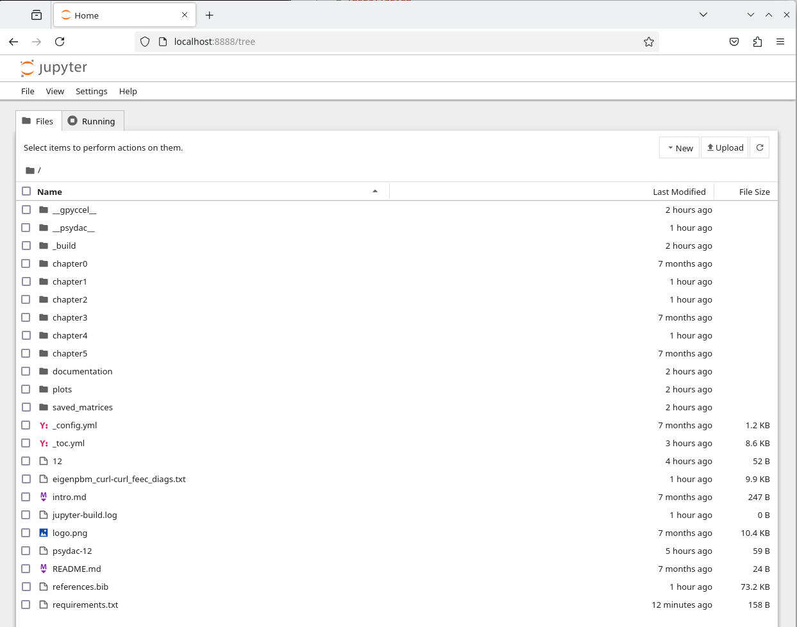
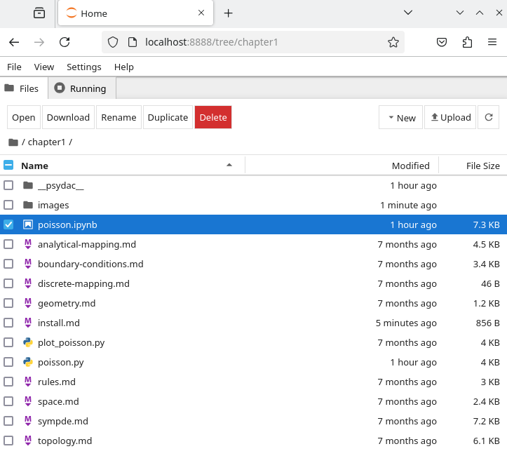

# Installation

To run the examples in this guide, we recommend to follow these steps:

1. Download the [IGA-Python] repository and then install its dependencies.

```bash
#  Download IGA-Python
git clone https://github.com/pyccel/IGA-Python.git
cd IGA-Python

# Install required Python packages
python3 -m venv iga-python-env
source iga-python-env/bin/activate
pip3 install -r requirements.txt
```

2. Access [IGA-Python] examples through Jupyter notebook.

```shell
# Run this command under IGA-Python folder 
jupyter notebook
```

Running `jupyter notebook` should automatically launch your web browser and show you the files in the current directory—in this case the [IGA-Python] files:



Try opening a sample notebook, e.g. `chapter1/poisson.ipynb`:




Open `poisson.ipynb` and verify that you can successfully run all cells in this notebook. 


3. When you close Jupyter and would like to run the [IGA-Python] examples, just open your Terminal/Console app and run these commands:

```shell
cd /full/path/to/your/IGA-Python    # Change this to where your IGA-Python folder is located
source iga-python-env/bin/activate
jupyter notebook
```

**Congratulations!** You can now head over to the [Poisson example problem](poisson.ipynb) to get started.

[IGA-Python]: https://github.com/pyccel/IGA-Python.git